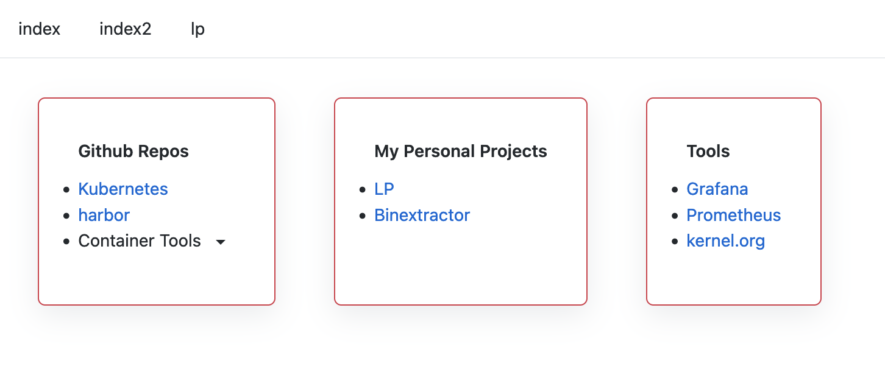

# LP



## LP config example

```
lpconfig: # Basic config for lp
  rootDir: /html
  port: 8080
  tls:
    key: /tls/tls.key
    cert: /tls/tls.crt
    ca: /tls/ca.crt
  sitename: lp
```

## Site Template Example

Template,pages,Headings are required. Links can be specified in solo as a "Url" or as a group with "Urls"

```
Template:
  Theme: "light" # https://primer.style/css/support/theming#set-a-theme
  Pages:
    - Name: index
      Headings:
        - Name: Github Repos
          Links:
          - Name: Kubernetes
            Url: https://github.com/kubernetes/kubernetes
          - Name: harbor
            Url: https://github.com/goharbor/harbor
          - Name: Container Tools
            Urls: 
              - cosign: https://github.com/sigstore/cosign
              - crane: https://github.com/google/go-containerregistry/
              - syft: https://github.com/anchore/syft
              - grype: https://github.com/anchore/grype 
              - cst: https://github.com/GoogleContainerTools/container-structure-test
              - ko: https://github.com/google/ko
        - Name: My Personal Projects
          Links:
          - Name: LP
            Url: https://github.com/rjbrown57/lp
          - Name: Binextractor
            Url: https://github.com/rjbrown57/binextractor
        - Name: Tools
          Links:
          - Name: Grafana
            Url: https://github.com/grafana/grafana
          - Name: Prometheus
            Url: https://github.com/prometheus
          - Name: kernel.org
            Url: https://kernel.org/
    - Name: index2
      Headings:
        - Name: Github Repos
          Links:
          - Name: Kubernetes
            Url: https://github.com/kubernetes/kubernetes
          - Name: harbor
            Url: https://github.com/goharbor/harbor
          - Name: Container Tools
            Urls: 
              - cosign: https://github.com/sigstore/cosign
              - crane: https://github.com/google/go-containerregistry/
              - syft: https://github.com/anchore/syft
              - grype: https://github.com/anchore/grype 
              - cst: https://github.com/GoogleContainerTools/container-structure-test
              - ko: https://github.com/google/ko
        - Name: My Personal Projects
          Links:
          - Name: LP
            Url: https://github.com/rjbrown57/lp
          - Name: Binextractor
            Url: https://github.com/rjbrown57/binextractor
        - Name: Tools
          Links:
          - Name: Grafana
            Url: https://github.com/grafana/grafana
          - Name: Prometheus
            Url: https://github.com/prometheus
          - Name: kernel.org
            Url: https://kernel.org/
```

## How to use 

Clone the repo and run `docker-compose up -d`. This will use the example [site.yaml](config/site.yaml). Please customize [site.yaml](config/site.yaml) as you see fit!

You could also run with `docker run -i -t -p 8080:8080 -v "${PWD}/config:/config" ghcr.io/rjbrown57/lp:latest` to get the same result

Last option is to grab a release and simply run `./lp_0.0.1_version_here -l path/to/lpConfig -s path/to/siteConfig1,path/to/siteConfig2` locally

```
./lp --help
A yaml based static link page for every day work use.

Usage:
  lp [flags]

Flags:
  -h, --help                   help for lp
  -l, --lpConfig string        base config for lp see https://github.com/rjbrown57/lp/blob/main/config/lp.yaml (default "config/lp.yaml")
  -s, --siteTemplate strings   comma seperated list of site tempaltes. See https://github.com/rjbrown57/lp/blob/main/config/site.yaml (default [config/site.yaml])
  -t, --toggle                 Help message for toggle
```

## Use with these browser plugins!

* https://addons.mozilla.org/en-US/firefox/addon/new-tab-override/?utm_source=addons.mozilla.org&utm_medium=referral&utm_content=search
* https://chrome.google.com/webstore/detail/new-tab-redirect/icpgjfneehieebagbmdbhnlpiopdcmna?hl=en-GB
